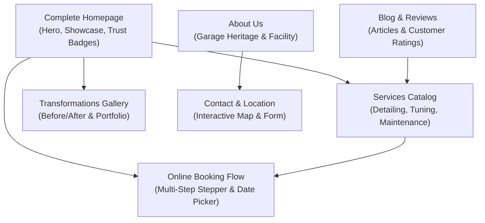

# Design System & Specification: KB Garage Premium Web Platform

> **Stitch Project ID:** `projects/3304741625800206292`  
> **Design Theme:** *Precision & Performance*  
> **Device Target:** Desktop & Responsive Mobile (1280px Grid Standard)  

---

## 1. Brand Identity & Design Philosophy

**KB Garage** represents an authoritative, high-performance automotive service and detailing platform targeting discerning vehicle owners who treat their cars as valuable investments.

### Core Visual Principles
- **Engineered Precision over Decorative Flair:** Clean geometric structure, tight tolerances, and predictable vertical rhythms mimicking aerospace and high-end automotive engineering.
- **High-Contrast Architectural Depth:** Tonal surface layering paired with tight, machined shadows rather than soft consumer-app blurs.
- **Tactile Feedback & Control:** Interactive elements (buttons, inputs, steppers) provide mechanical feedback with 200ms transitions and distinct focus indicators.

---

## 2. Color Palette & Design Tokens

The color architecture is built around **Midnight Blue** for authority and **Racing Red** for targeted high-visibility actions.

```
       Midnight Blue (#0F172A)              Logo Metallic Gold (#D4AF37)       Professional Green (#10B981)
┌──────────────────────────────────┐ ┌──────────────────────────────────┐ ┌──────────────────────────────────┐
│ Primary Brand / Headings / Nav   │ │ CTA Buttons / Active States      │ │ Status / Completed Steps         │
└──────────────────────────────────┘ └──────────────────────────────────┘ └──────────────────────────────────┘
```

### Token Reference Table

| Token Name | Hex Code | Purpose / Usage |
| :--- | :--- | :--- |
| `color-primary` | `#0f172a` | Main brand identity, primary text, navigation bar base |
| `color-primary-container` | `#131b2e` | Dark surface containers, dark card backgrounds |
| `color-secondary` | `#a37a1e` / `#d4af37` | Logo Metallic Gold CTA buttons, primary accents, active highlights |
| `color-secondary-container` | `#f4e6a1` | Hover states for primary CTAs, high-priority notifications |
| `color-tertiary` | `#10b981` / `#009668` | Success state, verified badges, completed stepper nodes |
| `color-background` | `#f7f9fb` | Canvas base background |
| `color-surface` | `#f8fafc` | Card and section background base |
| `color-surface-container-lowest` | `#ffffff` | Elevated interactive cards, modal surfaces |
| `color-surface-container-low` | `#f2f4f6` | Form input fills, subtle secondary cards |
| `color-surface-container` | `#eceef0` | Divider lines, inset container backgrounds |
| `color-surface-container-high` | `#e6e8ea` | Table headers, muted button backgrounds |
| `color-on-surface` | `#191c1e` | Main body text |
| `color-on-surface-variant` | `#45464d` | Secondary text, captions, metadata |
| `color-outline` | `#76777d` | Borders, inactive inputs, subtle dividers |
| `color-outline-variant` | `#c6c6cd` | Subtle card borders, resting input lines |
| `color-error` | `#ba1a1a` | Error messages, warning badges |
| `color-error-container` | `#ffdad6` | Error notification banners |

---

## 3. Typography Hierarchy

The system pairs the geometric power of **Montserrat** for headlines with the functional legibility of **Inter** for body text and metadata.

### Typographic Specifications

| Style Token | Font Family | Size | Weight | Line Height | Letter Spacing | Applied To |
| :--- | :--- | :--- | :--- | :--- | :--- | :--- |
| `headline-xl` | Montserrat | 48px | 700 (Bold) | 1.1 | -0.02em | Hero titles, landing page banners |
| `headline-xl-mobile` | Montserrat | 32px | 700 (Bold) | 1.2 | -0.01em | Mobile hero headers |
| `headline-lg` | Montserrat | 32px | 700 (Bold) | 1.2 | Standard | Major section headers |
| `headline-md` | Montserrat | 24px | 600 (SemiBold) | 1.3 | Standard | Card titles, subsection headers |
| `body-lg` | Inter | 18px | 400 (Regular) | 1.6 | Standard | Hero subtitles, intro paragraphs |
| `body-md` | Inter | 16px | 400 (Regular) | 1.5 | Standard | Standard body content, service details |
| `label-bold` | Inter | 14px | 600 (SemiBold) | 1.2 | +0.05em | Button text, table labels, badges |
| `caption` | Inter | 12px | 500 (Medium) | 1.4 | Standard | Price subtext, image captions, metadata |

---

## 4. Grid, Spacing & Layout System

Layouts strictly follow an **8px rhythmic grid system** for consistent vertical spacing and alignment.

### Grid Tokens
- **Container Max Width:** `1280px`
- **Gutter Width:** `24px`
- **Desktop Grid:** 12-column fluid layout with `40px` outer margins
- **Mobile Grid:** 4-column layout with `16px` outer margins
- **Section Spacing:** `80px` vertical gaps between primary page sections

### Spacing Scale
- `space-1` (4px): Micro adjustments, icon padding
- `space-2` (8px): Base rhythm unit, inline element gap
- `space-3` (16px): Compact container padding, mobile margin
- `space-4` (24px): Standard card inner padding, grid gutter
- `space-5` (32px): Component group separation
- `space-6` (40px): Desktop page side margins
- `space-8` (64px): Sub-section vertical gaps
- `space-10` (80px): Major page section breaks

---

## 5. Elevation, Shapes & Depth

### Corner Radii (Precision Engineering Aesthetic)
- `rounded-sm`: `0.125rem` (2px) – Chips, small status tags
- `rounded-default`: `0.25rem` (4px) – Standard buttons, form fields, action cards
- `rounded-md`: `0.375rem` (6px) – Dropdown menus, tooltips
- `rounded-lg`: `0.5rem` (8px) – Feature service containers, hero image frames
- `rounded-full`: `9999px` – Circular avatars, pill badges

### Depth Levels & Shadow Tokens
- **Level 0 (Base Layer):** `#F8FAFC` flat surface.
- **Level 1 (Cards & Inset Containers):** `#FFFFFF` fill with `1px` solid border (`#E2E8F0`) and `0 4px 6px -1px rgba(15, 23, 42, 0.05)`.
- **Level 2 (Modals, Overlays & Sticky Header):** `#FFFFFF` fill with `0 20px 25px -5px rgba(15, 23, 42, 0.15)` and `12px` backdrop blur (`backdrop-filter: blur(12px)`).

---

## 6. UI Component Patterns

### 1. Primary Button
- **Background:** Logo Metallic Gold (`#D4AF37`)
- **Text:** Dark Slate (`#0F172A`), `label-bold` style
- **Border Radius:** `0.25rem` (4px)
- **Hover State:** Background darkens to `#A37A1E`, scale `1.01`, `transition: all 200ms ease`

### 2. Secondary Button
- **Background:** Transparent / Surface (`#FFFFFF`)
- **Border:** `1px` solid Midnight Blue (`#0F172A`)
- **Text:** Midnight Blue (`#0F172A`), `label-bold`
- **Hover State:** Background shifts to `#ECEEF0`

### 3. Service Card
- **Structure:** Top high-res image (16:9 ratio), followed by `headline-md` title, spec list, and "Price From" caption.
- **Hover Micro-interaction:** Lifts `4px` vertically with expanded Level 2 shadow.

### 4. Input Fields
- **Background:** Surface Low (`#F2F4F6`)
- **Border:** Bottom-only `2px` stroke (`#C6C6CD`) resting, transforming into `2px` full Logo Metallic Gold (`#D4AF37`) ring on focus.
- **Labels:** Uppercase `label-bold` floating/top-aligned.

### 5. Multi-step Progress Stepper
- **Layout:** Horizontal progress bar with numbered nodes.
- **Completed Node:** Filled Professional Green (`#10B981`) with check icon.
- **Active Node:** Highlighted Logo Metallic Gold (`#D4AF37`) with outer ring indicator.
- **Upcoming Node:** Muted Gray (`#ECEEF0`) with outline ring.

---

## 7. Site Map & Page Architecture

The KB Garage project includes 7 core screen templates:



### Screen Overview & Specifications

1. **KB Garage - Complete Homepage** (`09e44a7e51c54beea10a034b6a250f7c`)
   - High-impact hero section with primary CTA "Book Service Now".
   - Service highlights showcase grid.
   - Live booking CTA banner and customer testimonial slider.

2. **KB Garage - Services** (`d434b16c51c8454fa3ae0ff459cb6d22`)
   - Categorized service modules: Ceramic Coating, Performance Tuning, Routine Maintenance, Paint Protection Film (PPF).
   - Interactive pricing and feature breakdown tables.

3. **KB Garage - Online Booking** (`44f71bca763d476b95bbaecdafd7541c`)
   - Step 1: Vehicle Details (Make, Model, Year, VIN/Plate).
   - Step 2: Service Selection & Add-ons.
   - Step 3: Date & Time Slot Reservation.
   - Step 4: Contact Info & Instant Confirmation.

4. **KB Garage - Gallery** (`60603e74f2a24b29a15cfa3b68f69e49`)
   - Filterable high-resolution project portfolio.
   - Interactive Before/After image comparison sliders.

5. **KB Garage - About Us** (`b721c0b57ef24ae1a68bc04e2ccc5845`)
   - Brand narrative, master technician bios, state-of-the-art facility equipment specs.

6. **KB Garage - Blog & Reviews** (`2df0b7c5c7e8482aa4b2aa707326cfc0`)
   - Technical car care guides, maintenance schedules, verified client reviews with star breakdowns.

7. **KB Garage - Contact** (`3ef77a4c6aca436b993dee76035836fb`)
   - Operating hours, location address, emergency hotline, integrated enquiry form.
